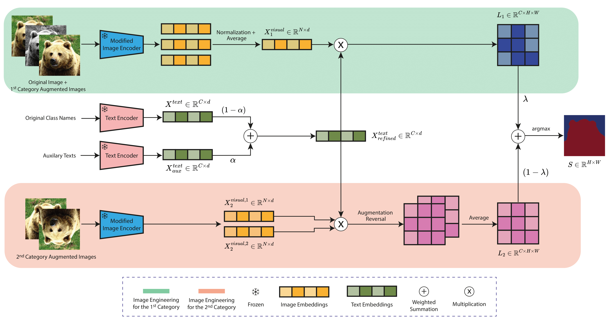

# ITACLIP: Boosting Training-Free Semantic Segmentation with Image, Text, and Architectural Enhancements [CVPRW 2025]

[[`arxiv`](https://arxiv.org/abs/2411.12044)] [[`paper`](https://openaccess.thecvf.com/content/CVPR2025W/PixFoundation/papers/Aydin_ITACLIP_Boosting_Training-Free_Semantic_Segmentation_with_Image_Text_and_Architectural_CVPRW_2025_paper.pdf)]

> **Abstract:** *Recent advances in foundational Vision Language Models (VLMs) have reshaped the evaluation paradigm in computer vision tasks. These foundational models, especially CLIP, have accelerated research in open-vocabulary computer vision tasks, including Open-Vocabulary Semantic Segmentation (OVSS). Although the initial results are promising, the dense prediction capabilities of VLMs still require further improvement. In this study, we enhance the semantic segmentation performance of CLIP by introducing new modules and modifications: 1) architectural changes in the last layer of ViT and the incorporation of attention maps from the middle layers with the last layer, 2) Image Engineering: applying data augmentations to enrich input image representations, and 3) using Large Language Models (LLMs) to generate definitions and synonyms for each class name to leverage CLIP's open-vocabulary capabilities. Our training-free method, ITACLIP, outperforms current state-of-the-art approaches on segmentation benchmarks such as COCO-Stuff, COCO-Object, Pascal Context, and Pascal VOC.* 

<div align="center">
  
</div><br/>

## :tada: News
**`2024/11/18` Our paper and code are publicly available.**  
**`2025/04/01` Our paper has been accepted to CVPRW 2025. :tada: :tada:**

## Dependencies
Our code is built on top of [MMSegmentation](https://github.com/open-mmlab/mmsegmentation). Please follow the [instructions](https://mmsegmentation.readthedocs.io/en/main/get_started.html) to install MMSegmentation. We used ```Python=3.9.17```, ```torch=2.0.1```,  ```mmcv=2.1.0```, and ```mmseg=1.2.2``` in our experiments. 

## Datasets
We support four segmentation benchmarks: COCO-Stuff, COCO-Object, Pascal Context, and Pascal VOC. For the dataset preparation, please follow the [MMSeg Dataset Preparation document](https://github.com/open-mmlab/mmsegmentation/blob/main/docs/en/user_guides/2_dataset_prepare.md). The COCO-Object dataset can be derived from COCO-Stuff by running the following command

```
python datasets/cvt_coco_object.py PATH_TO_COCO_STUFF164K -o PATH_TO_COCO164K
```

Additional datasets can be seamlessly integrated following the same dataset preparation document. Please modify the dataset (```data_root```) and class name (```name_path```) paths in the config files. 

## LLaMa Generated Texts
For reproducibility, we provide the LLM-generated auxiliary texts. Please update the auxiliary path (```auxiliary_text_path```) in the config files. We also provide the definition and synonym generation codes (```llama3_definition_generation.py```and ```llama3_synonym_generation.py```). For the supported datasets, running these files is unnecessary, as we have already included the LLaMA-generated texts.
## Evaluation
To evaluate ITACLIP on a dataset, run the following command updating the dataset_name.
```
python eval.py --config ./configs/cfg_{dataset_name}.py
```
## Demo
To evaluate ITACLIP on a single image, run the ```demo.ipynb``` Jupyter Notebook
## Results
With the default configurations, you should achieve the following results (mIoU).

| Dataset               | mIoU  |
| --------------------- | ----- |
| COCO-Stuff            | 27.0  |
| COCO-Object           | 37.7  |
| PASCAL VOC            | 67.9  |
| PASCAL Context        | 37.5  |
| Cityscapes            | 40.2  |

## Citation
If you find our project helpful, please consider citing our work. 

```
@inproceedings{aydin2025itaclip,
  title={ITACLIP: Boosting Training-Free Semantic Segmentation with Image, Text, and Architectural Enhancements},
  author={Ayd{\i}n, M Arda and C{\i}rpar, Efe Mert and Abdinli, Elvin and Unal, Gozde and Sahin, Yusuf H},
  booktitle={Proceedings of the Computer Vision and Pattern Recognition Conference},
  pages={4142--4152},
  year={2025}
}
```

## Acknowledgments
This implementation builds upon [CLIP](https://github.com/openai/CLIP), [SCLIP](https://github.com/wangf3014/SCLIP), and [MMSegmentation](https://github.com/open-mmlab/mmsegmentation). We gratefully acknowledge their valuable contributions.


